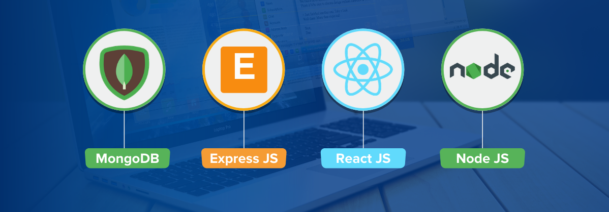

<h2 align="left">
 <abc>
 
   
   
    Hello! I'm Nazmul Huda. A MERN Stack Web Developer :computer:
   
   
 </abc>
  
  
</h2> 
<h2 align="left">:hammer_and_wrench: Technologies and Tools I use:</h2>

    
    
    
    
    
    
    
    
    
    

<h2 align="left">👨🏻‍💻 About Me:</h2>

- 👨🏽‍💻 I’m currently working on react.js, next.js
- 🌱 I’m currently learning typescript
- 💬 Ask me about anything, I am happy to help
- 📫 How to reach me: [Nazmul Huda](https://www.facebook.com/nznazmulhuda)
- 💬 Contact no - 01580507352 (mobile & whatsapp)
- 🌱 Email address - nznazmulhuda04@gmail.com
- 📫 My CV - [Click to See](https://docs.google.com/document/d/1qSjpGOiHrYuolFDX7KH7Ph-fEwu3CsW6VeR0tLKb2OE/edit?usp=sharing)

<h2 align="left">:heart: Let's get connected:</h2>

 
 

