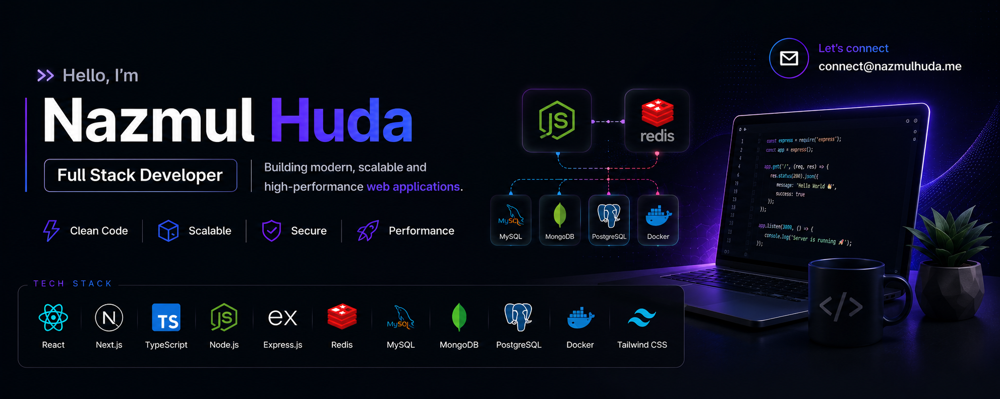

 

# Nazmul Huda

### Full Stack Developer

Building modern, scalable and high-performance web applications.

<a target="_blank" href="https://nazmulhuda.me">Portfolio</a>
•
<a href="mailto:connect@nazmulhuda.me">Email</a>

---

# About

I'm a Full Stack Developer from Bangladesh who enjoys building scalable web applications with modern technologies.

My primary focus is developing clean, maintainable software that delivers excellent user experiences while following industry best practices.

Currently exploring AI integration, automation, and scalable backend architecture.

---

# Tech Stack

### Frontend

### Backend

### Database

### Tools

---

# Featured Projects

## 🛒 Orbit Outfit

Production-ready full-stack e-commerce platform featuring authentication, shopping cart, order management, Redis caching, and optimized backend performance.

**Tech Stack**

`Next.js` • `Express.js` • `PostgreSQL` • `Redis`

**Links**

🌐 https://orbitoutfit.com

💻 https://github.com/nznazmulhuda/orbit-outfits *(replace with actual repository)*

---

## 🏨 Hotel Management System

Modern hotel management platform with booking management, room management, customer records, reporting, and role-based dashboards.

**Tech Stack**

`Next.js` • `Express.js` • `MongoDB` • `Tailwind CSS`

**Links**

🌐 https://hotelmanagementsoft.vercel.app

💻 https://github.com/nznazmulhuda/hotel-management-system *(replace with actual repository)*

---

<!-- # GitHub Analytics

 

--- -->

# Professional Experience

**Frontend Developer & No-Code / Low-Code Developer**  
**InnerScape Agency** *(Sep 2025 – Present)*

- Developed modern web applications using React.js, Next.js, Node.js, and TypeScript.
- Built responsive business websites and scalable client solutions.
- Delivered 40+ client projects across React, Next.js, Framer, Webflow, and WordPress.
- Collaborated with remote teams while maintaining clean and maintainable code.

---

# Let's Connect

<a target="_blank" href="https://nazmulhuda.me">Portfolio</a> •
<a target="_blank" href="mailto:connect@nazmulhuda.me">Email</a>

---

> **"First solve the problem. Then write clean code."**

